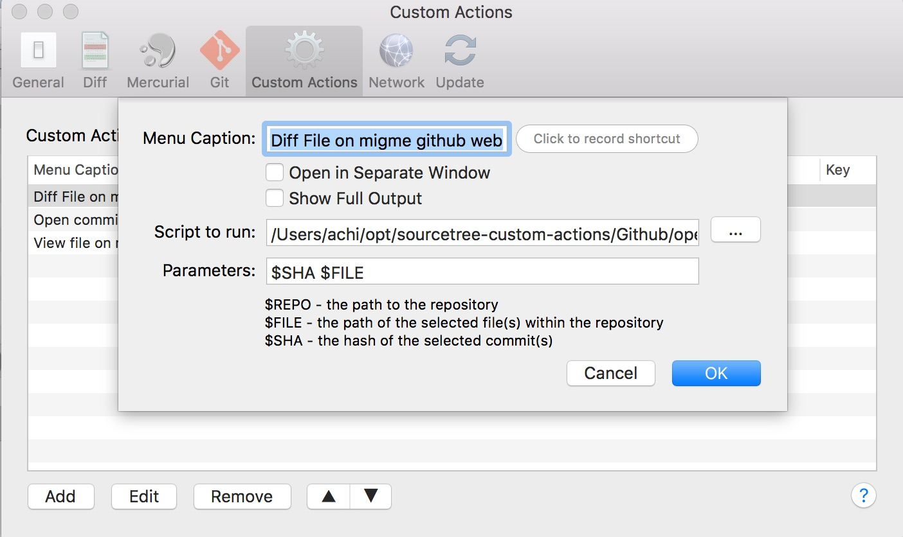
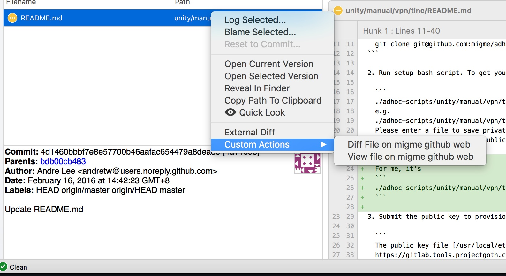

# sourcetree-custom-actions

# Installation

To install custom action into SourceTree, 

1. Clone this repo to your machine
2. in SourceTree **Preference** choose **Custom Action**
3. Add a new custom action, in **Script to run**, choose the script in this repo, specify proper **Parameter** according to the table below.
    
4. You can use the custom action from context menu
    
    
    
# Script and Parameters

| Script | Usage | Parameter |
|--------|-------|-----------|
| [open_commit_on_github.sh](open_commit_on_github.sh) | Open a commit on github web | ```$SHA``` | 
| [open_diff_of_file_on_github.sh](open_diff_of_file_on_github.sh) | Diff a file change in a commit on github web | ```$SHA $FILE``` | 
| [view_file_on_github.sh](view_file_on_github.sh) | View the file in chosen version on github web | ```$SHA $FILE``` | 